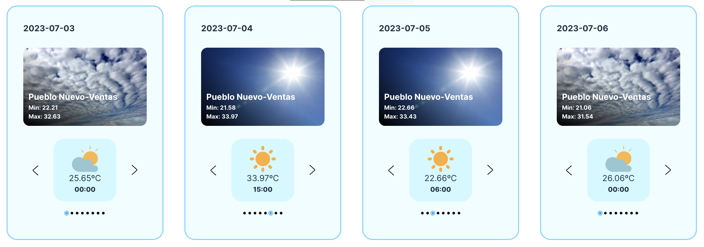

# Weather App

Aplicación desarrollada en la librería `React`, usando `useState` y `useEffect`.

## Uso

Si el usuario permite usar su localización, lo primero que se verá será el tiempo en los próximos días, junto con la temperatura máxima y mínima previstas para cada día.
Incluye un `input` de tipo texto con un botón para que el usuario pueda buscar la ciudad que le plazca y conocer el tiempo metereológico previsto para los 6 próximos días.
Tiene iconos e imágenes que responden al estado del tiempo que esté seleccionado.

## Contenido

- [Vista general](#vista-general)
  - [Capturas de pantalla](#captura-de-pantalla)
  - [Links](#links)
- [Proceso](#proceso)
  - [Tecnologías de desarrollo](#tecnologías-de-desarrollo)
  - [A mejorar](#a-mejorar)
  - [Recursos](#recursos)
- [Autor](#autor)

## Vista general

En esta pequeña aplicación, el usuario podrá:

- Si no introduce ninguna ciudad, y permite usar la localización del navegador, consultar el tiempo en su zona durante los siguientes días
- Comprobar el estado del tiempo en la ciudad que introduzca en el `input`

### Capturas de pantalla

### Links

- [Repositorio de GitHub](https://github.com/aerozfx/react-weather-app.git)
- [Demo](https://your-live-site-url.com)

## Proceso

### Tecnologías de desarrollo

- Uso de HTML5 semántico
- CSS personalizado
- Flexbox
- Aplicación desarrollada siguiendo la estrategia de diseño `mobile first`
- [React](https://reactjs.org/) - JS library

### A mejorar

Falta añadir un `slider` para que la experiencia de usuario sea más satisfactoria

### Recursos

- [MDN: Scroll into view](https://developer.mozilla.org/en-US/docs/Web/API/Element/scrollIntoView) - Emular efecto de slider
- [Ejemplo de slider con React](https://codesandbox.io/s/32xjhx?file=/App.js:155-176&utm_medium=sandpack) - Sandbox del efecto a emular

## Autor

- Website - [Fernando Mariño](https://github.com/aerozfx)
